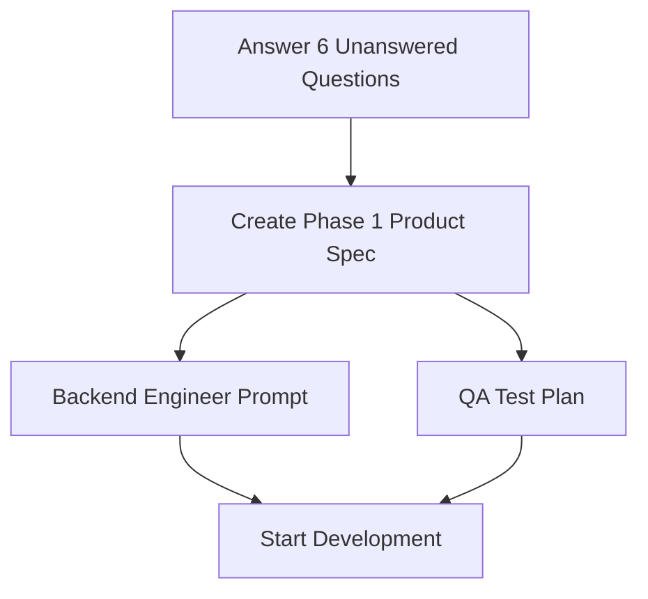

# WorthIT Product Management Documentation

**Created:** June 21, 2026  
**PM:** Claude  
**Status:** Active — Phase 1 Planning

---

## Overview

This folder contains product strategy, technical audits, and implementation plans for WorthIT.

### Documents

1. **[01_Product_Strategy_and_Technical_Audit.md](01_Product_Strategy_and_Technical_Audit.md)** (Primary — For Founder)
   - Product vision and user goals
   - Complete 25-gap technical audit
   - Phase 1, 2, 3 roadmap
   - Timeline to real users
   - Critical path dependencies

2. **[BACKEND_ENGINEER_PROMPT_PHASE_1_2026-06-21.md](BACKEND_ENGINEER_PROMPT_PHASE_1_2026-06-21.md)** (EXECUTABLE — For Backend Engineer)
   - **Start here:** Copy and paste to backend engineer
   - Complete Phase 1 backend specifications
   - Database schema, API endpoints, fraud detection
   - Success criteria and testing requirements

3. **[02_Phase_1_Technical_Reference.md](02_Phase_1_Technical_Reference.md)** (Reference — Detailed specs)
   - Current system state (v0.1)
   - Database schema changes (User, Product, Analysis, UsageLog, UserFeedback)
   - API endpoint specifications (new/updated)
   - Marketplace integration requirements (Facebook, Yad2)
   - Fraud detection implementation
   - Logging, monitoring, rate limiting config
   - Integration test examples
   - Success criteria for Phase 1 complete

---

## Key Decisions Made (2026-06-21)

### Product Vision
- **Target:** Everyone who buys/sells on second-hand marketplaces
- **Problem:** Users can't distinguish fair deals from scams
- **Solution:** One-click verdict on any listing (price analysis + fraud detection)
- **MVP Scope:** Facebook + Yad2, Tavily pricing, basic fraud detection

### Roadmap
- **Phase 1 (Weeks 1-5):** MVP for reseller recruitment (Google OAuth, User model, fraud detection)
- **Phase 2 (Weeks 6-9):** Feedback loop, specs-aware comparison, seller reputation
- **Phase 3 (Weeks 10-16):** Multi-marketplace (eBay, Amazon), subscription tiers, monetization

### Timeline to Real Users
- **Week 5:** Phase 1 complete, reseller recruitment begins
- **Week 6-9:** Real users testing Phase 1 + Phase 2 development
- **Week 9:** Phase 2 complete, measure engagement
- **Week 16:** Phase 3 complete, subscription live, ready for paid growth

---

## Unanswered Questions (For Founder)

### 1. Yad2 Integration ❓
- [ ] Does Yad2 have a public API?
- [ ] Should we use DOM extraction or API?
- [ ] Do you have test Yad2 account for development?

### 2. Facebook Seller Ratings ❓
- [ ] Can we use Facebook Graph API?
- [ ] Do we need to register a Facebook App?
- [ ] Can you add backend engineer as test user on your account?
- [ ] Fallback: Is DOM extraction acceptable?

### 3. Tavily Budget ❓
- [ ] Are you aware of Tavily API costs?
- [ ] Should we monitor spending during Phase 1 testing?
- [ ] Do you have Tavily account already?

### 4. Team & Infrastructure ❓
- [ ] Who is building Phase 1 (backend engineer available)?
- [ ] Is MongoDB running locally?
- [ ] What Node.js version in use?
- [ ] Do you have Sentry account set up?

### 5. Success Criteria ❓
- [ ] What definition of "Phase 1 complete" triggers reseller recruitment?
- [ ] Metrics: 96 tests passing? Zero critical bugs? E2E manual test?
- [ ] Can Phase 1 deploy to staging/production for testing?

### 6. Reseller Recruitment ❓
- [ ] Timeline: When do you want to start recruiting?
- [ ] How: Facebook posts + LinkedIn messages?
- [ ] Who: Specific resellers you know, or cold outreach?
- [ ] How many: 10 resellers? 20? 100?

---

## Critical Path (What Must Happen First)

---

## Next Immediate Actions (For Claude PM)

After founder answers the 6 questions:

1. **Create Phase 1 Product Specification**
   - Feature-by-feature breakdown
   - User stories
   - Acceptance criteria
   - Edge cases

2. **Create Backend Engineer Prompt**
   - Database design
   - API endpoints (full spec)
   - Validation rules
   - Error handling

3. **Create QA Engineer Prompt**
   - Test plan for all new features
   - Manual testing scenarios
   - Edge cases and failure modes
   - Integration test requirements

4. **Create Architecture Review Prompt**
   - Code standards
   - Security review
   - Scalability assessment
   - Technical debt analysis

---

## What's Working (Don't Break)

✅ **Core Analysis Engine**
- Deterministic verdict logic (percentile-based)
- AI reasoning generation (OpenAI)
- Condition analysis
- Test coverage (96 tests passing)

✅ **Chrome Extension**
- Facebook DOM extraction (works but fragile)
- Popup UI for "Analyze" button
- Message passing to backend

✅ **Backend Structure**
- Express API setup
- MongoDB integration
- Tavily API integration
- JWT token generation

---

## What's Broken (Must Fix)

❌ **Critical Path Blockers (Phase 1):**
- Google OAuth stub (accepts any token)
- No User model (can't track users)
- No userId in Analysis (can't save history)
- No quota enforcement (can't limit usage)
- No Yad2 support (incomplete marketplace coverage)
- No fraud detection (stock photos, price sanity)
- No logging/monitoring (can't debug production)

See [01_Product_Strategy_and_Technical_Audit.md](01_Product_Strategy_and_Technical_Audit.md) for full audit.

---

## How to Read This Documentation

**If you're the Founder (Shai):**
- Read: [01_Product_Strategy_and_Technical_Audit.md](01_Product_Strategy_and_Technical_Audit.md) — Sections "Product Vision" and "MVP Roadmap"
- Answer: The 6 unanswered questions above
- Next: Approve Phase 1 roadmap or suggest changes

**If you're the Backend Engineer:**
- Read: [BACKEND_ENGINEER_PROMPT_PHASE_1_2026-06-21.md](BACKEND_ENGINEER_PROMPT_PHASE_1_2026-06-21.md) — **START HERE**
- This is the complete executable spec — copy and paste to start work
- All database schema, API endpoints, and success criteria included
- Reference: [02_Phase_1_Technical_Reference.md](02_Phase_1_Technical_Reference.md) for additional context

**If you're the QA Engineer:**
- Read: [02_Phase_1_Technical_Reference.md](02_Phase_1_Technical_Reference.md) — "Integration Tests" section
- Wait for: QA test plan prompt (coming after founder approval)

---

## Document Versioning

| Version | Date | Changes |
|---------|------|---------|
| 1.0 | 2026-06-21 | Initial product strategy and technical audit |
| | | Complete Phase 1-3 roadmap |
| | | 25-gap technical audit |
| | | Database schema specifications |
| | | 6 unanswered questions documented |

---

## Archive

### Session: PM Product Strategy Definition (2026-06-21)

**What was accomplished:**
1. Reviewed codebase state (v0.1 early MVP)
2. Defined product vision (second-hand marketplace scam detection)
3. Identified target users (resellers, bargain hunters)
4. Conducted comprehensive technical audit (25 gaps identified)
5. Prioritized gaps for MVP
6. Created Phase 1-3 roadmap
7. Estimated timeline to real users (Week 5-9)
8. Documented critical path and success criteria
9. Identified 6 unanswered questions for founder approval

**Deliverables:**
- Product strategy document
- Technical reference (database, API, infrastructure)
- Phase 1-3 roadmap
- 25-gap technical audit
- Timeline to real users
- Success criteria

**Next session:** After founder answers 6 questions, create detailed implementation prompts for backend/QA/architecture.

---

## Contact & Questions

**Product Manager:** Claude  
**Project:** WorthIT (AI second-hand marketplace analysis)  
**Status:** Phase 1 Planning  
**Last Updated:** June 21, 2026

For questions about product strategy or technical decisions, refer to the main documents above.

---

**Want to move forward?** Have the founder answer the 6 unanswered questions, then we'll create detailed implementation specs for the engineering team.
